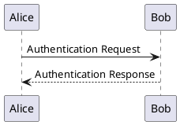
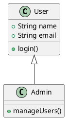
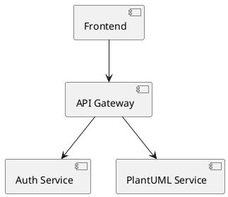

# Docmost PlantUML - Functional Requirements Document (FRD)

## PlantUML Diagram Support for Docmost

**Version:** 1.0  
**Date:** 2025-12-15  
**Status:** Draft  
**Author:** Development Team

---

## 1\. Executive Summary

Add PlantUML diagram support to Docmost wiki platform, enabling users to create and edit UML diagrams using PlantUML syntax. Diagrams will be rendered server-side and integrated into the existing editor following the Draw.io/Excalidraw pattern.

---

## 2\. Background & Context

### 2.1 Current State

- Docmost currently supports three diagram types:
    - **Mermaid**: Client-side rendering from code blocks
    - **Draw.io**: Server-side rendering with embedded source data
    - **Excalidraw**: Client-side rendering with embedded scene data

### 2.2 Problem Statement

PlantUML is a widely-used diagram tool for software documentation, but it requires server-side rendering (Java-based). Users need PlantUML support for:

- UML class diagrams
- Sequence diagrams
- Component diagrams
- Deployment diagrams
- And 50+ other diagram types

### 2.3 Key Insights from Analysis

- Draw.io and Excalidraw embed source data in SVG files
- Page history system stores full ProseMirror JSON content
- Attachments are updated (not versioned) when diagrams change
- Storing source code in node attributes ensures proper version control

---

## 3\. Requirements

### 3.1 Functional Requirements

#### FR-1: PlantUML Code Editor

**Priority:** MUST HAVE  
**Description:** Users can write and edit PlantUML code in a dedicated editor interface.

**Acceptance Criteria:**

- User can insert PlantUML diagram from slash menu (`/plantuml`)
- Code editor opens with syntax highlighting
- Default template provided for new diagrams
- Real-time preview of rendered diagram
- Errors displayed with clear error messages
- Support for multi-line PlantUML syntax

**UI/UX:**

- Modal editor (similar to code blocks)
- Split view: code on left, preview on right
- Save button to commit changes
- Cancel button to discard changes

---

#### FR-2: Server-Side Rendering

**Priority:** MUST HAVE  
**Description:** PlantUML diagrams are rendered on the backend using a PlantUML server.

**Acceptance Criteria:**

- Backend API endpoint: `POST /api/diagrams/plantuml/render`
- Accepts PlantUML source code as input
- Calls PlantUML server via HTTP
- Returns SVG output
- Handles rendering errors gracefully
- Supports all PlantUML diagram types

**Technical Specifications:**

```typescript
// Request payload
{
  code: string;           // PlantUML source code
  pageId: string;         // Page ID for attachment
  attachmentId?:  string;  // Optional:  for updates
}

// Response
{
  src: string;           // SVG file URL
  attachmentId:  string;  // Attachment ID
  title: string;         // File name
  size: number;          // File size in bytes
}
```

---

#### FR-3: Docker Compose Integration

**Priority:** MUST HAVE  
**Description:** PlantUML server runs as a Docker service alongside Docmost.

**Acceptance Criteria:**

- `docker-compose.yml` includes PlantUML service
- Service uses official `plantuml/plantuml-server: jetty` image
- Accessible only within Docker network (not exposed publicly)
- Configuration via environment variable: `PLANTUML_SERVER_URL`
- Default URL: `http://plantuml: 8080`

**Docker Compose Configuration:**

```yaml
services:
  docmost:
    environment:
      PLANTUML_SERVER_URL:  'http://plantuml:8080'
    depends_on:
      - plantuml

  plantuml:
    image: plantuml/plantuml-server:jetty
    restart: unless-stopped
    environment:
      - BASE_URL=plantuml
```

---

#### FR-4: Source Code Versioning

**Priority:** MUST HAVE  
**Description:** PlantUML source code is stored in page content for proper version control.

**Acceptance Criteria:**

- PlantUML code stored in node `attrs. code`
- Code hash stored to detect changes (`attrs.codeHash`)
- Attachment ID stored for efficient rendering (`attrs.attachmentId`)
- SVG URL stored for display (`attrs.src`)
- Historical versions preserve source code
- Restoring page history shows correct diagram

**Node Structure:**

```json
{
  "type": "plantuml",
  "attrs": {
    "code": "@startuml\nAlice -> Bob:  Hello\n@enduml",
    "codeHash": "sha256-abc123.. .",
    "src": "/api/files/{id}/diagram.plantuml. svg",
    "attachmentId": "uuid-v7",
    "width": "100%",
    "align": "center",
    "title": "diagram. plantuml.svg",
    "size": 12345
  }
}
```

---

#### FR-5: Attachment Management

**Priority:** MUST HAVE  
**Description:** PlantUML diagrams are stored as SVG attachments, following existing patterns.

**Acceptance Criteria:**

- First render creates new attachment
- Subsequent edits update existing attachment (same `attachmentId`)
- Old SVG file is overwritten (no orphaned files)
- Attachment metadata updated (`updatedAt` timestamp)
- Cache-busting URL parameter added (`?t=timestamp`)
- SVG file stored at: `{workspaceId}/files/{attachmentId}/diagram.plantuml.svg`

**Attachment Update Logic:**

```typescript
if (attachmentId && codeHash !== previousCodeHash) {
  // Update existing attachment
  await uploadFile(svgFile, pageId, attachmentId);
} else if (! attachmentId) {
  // Create new attachment
  await uploadFile(svgFile, pageId);
}
```

---

#### FR-6: Page History Integration

**Priority:** MUST HAVE  
**Description:** PlantUML diagrams work correctly with page history and version restoration.

**Acceptance Criteria:**

- Page history snapshots include PlantUML source code
- Viewing old version displays correct diagram
- Restoring old version preserves PlantUML code
- Editing restored version re-renders from stored code
- No data loss during version operations

**Restoration Flow:**

1.  User restores page to previous version
2.  Editor loads with old PlantUML code
3.  If user edits, new SVG is rendered
4.  Attachment is updated with new diagram
5.  Page history creates new snapshot

---

### 3.2 Non-Functional Requirements

#### NFR-1: Performance

- Diagram rendering completes within 5 seconds
- PlantUML server responds within 3 seconds
- No UI blocking during rendering
- Loading indicator shown during render

#### NFR-2: Scalability

- PlantUML server can be scaled independently
- Support for concurrent diagram rendering
- No hard limit on diagram complexity (within PlantUML constraints)

#### NFR-3: Security

- PlantUML server not exposed to public internet
- Input validation on PlantUML code
- File size limits enforced (default: 50MB)
- No arbitrary code execution allowed

#### NFR-4: Reliability

- Graceful degradation if PlantUML server unavailable
- Error messages guide users to fix syntax errors
- Fallback display if SVG fails to load
- Retry logic for transient failures

#### NFR-5: Configuration

- PlantUML server URL configurable via environment variable
- Fallback to public PlantUML server (optional)
- Support for custom PlantUML server installations
- Configuration validated on startup

---

## 4\. Technical Architecture

### 4.1 Component Overview

```
┌─────────────────┐      ┌──────────────────┐      ┌─────────────────┐
│   Client App    │─────▶│  Backend API     │─────▶│ PlantUML Server │
│  (React/Tiptap) │      │  (NestJS)        │      │  (Docker)       │
└─────────────────┘      └──────────────────┘      └─────────────────┘
        │                         │
        │                         ▼
        │                 ┌──────────────────┐
        └────────────────▶│ Storage Service  │
                          │ (S3/Local)       │
                          └──────────────────┘
```

### 4.2 File Structure

```
docmost/
├── docker-compose.yml                           # Add PlantUML service
├── . env. example                                 # Add PLANTUML_SERVER_URL
│
├── apps/
│   ├── server/
│   │   └── src/
│   │       ├── integrations/environment/
│   │       │   ├── environment.service.ts       # Add getPlantUmlServerUrl()
│   │       │   └── environment.validation.ts    # Add validation
│   │       │
│   │       └── core/diagrams/
│   │           ├── diagrams.module.ts           # NEW
│   │           ├── diagrams.controller.ts       # NEW
│   │           └── diagrams.service.ts          # NEW
│   │
│   └── client/
│       ├── vite.config.ts                       # Add PLANTUML_SERVER_URL
│       └── src/
│           ├── features/editor/
│           │   ├── components/
│           │   │   ├── plantuml/
│           │   │   │   ├── plantuml-view.tsx    # NEW
│           │   │   │   └── plantuml-menu.tsx    # NEW
│           │   │   └── slash-menu/
│           │   │       └── menu-items.ts        # Add PlantUML item
│           │   └── extensions/
│           │       └── extensions.ts            # Register PlantUML
│           │
│           ├── components/icons/
│           │   └── icon-plantuml.tsx            # NEW
│           │
│           └── lib/
│               └── config.ts                    # Add getPlantUmlServerUrl()
│
└── packages/
    └── editor-ext/
        └── src/lib/
            └── plantuml.ts                      # NEW - TipTap extension
```

### 4.3 Data Flow

#### 4.3.1 Creating New Diagram

```
1. User types "/plantuml" → Slash menu opens
2. User selects "PlantUML diagram" → Editor modal opens
3. User writes PlantUML code → Preview shows in real-time
4. User clicks "Save" → Code sent to backend
5. Backend calls PlantUML server → SVG generated
6. Backend saves SVG as attachment → Attachment ID returned
7. Frontend updates node attributes → Diagram displayed in page
```

#### 4.3.2 Editing Existing Diagram

```
1. User double-clicks diagram → Editor modal opens with existing code
2. User modifies code → Preview updates
3. User clicks "Save" → Code sent to backend with attachmentId
4. Backend calls PlantUML server → New SVG generated
5. Backend updates existing attachment → Same ID, new content
6. Frontend updates node attributes → Updated diagram displayed
```

#### 4.3.3 Restoring Page Version

```
1. User opens page history → Selects old version
2. User clicks "Restore" → Page content reverted
3. PlantUML node contains old code → Old code displayed
4. Diagram SVG may show current version (acceptable)
5. If user edits → Re-render from stored old code
6. New attachment created/updated → Correct diagram shown
```

---

## 5\. Implementation Details

### 5.1 Backend Implementation

#### 5.1.1 Environment Configuration

**File:** `apps/server/src/integrations/environment/environment.service.ts`

```typescript
getPlantUmlServerUrl(): string {
  return this.configService.get<string>(
    'PLANTUML_SERVER_URL',
    'http://plantuml:8080'
  );
}
```

**File:** `apps/server/src/integrations/environment/environment.validation.ts`

```typescript
@IsOptional()
@IsUrl({ protocols: ['http', 'https'], require_tld: false })
PLANTUML_SERVER_URL:  string;
```

---

#### 5.1.2 Diagrams Service

**File:** `apps/server/src/core/diagrams/diagrams.service.ts`

```typescript
@Injectable()
export class DiagramsService {
  constructor(
    private readonly environmentService: EnvironmentService,
    private readonly attachmentService: AttachmentService,
  ) {}

  async renderPlantUml(opts: {
    code: string;
    pageId: string;
    userId:  string;
    spaceId: string;
    workspaceId: string;
    attachmentId?: string;
  }): Promise<Attachment> {
    // 1. Validate PlantUML code
    if (!opts.code || opts.code.trim().length === 0) {
      throw new BadRequestException('PlantUML code is required');
    }

    // 2. Call PlantUML server
    const plantumlServerUrl = this.environmentService.getPlantUmlServerUrl();
    const svgBuffer = await this.callPlantUmlServer(plantumlServerUrl, opts. code);

    // 3. Convert SVG buffer to file
    const svgFile = await this.bufferToMultipartFile(
      svgBuffer,
      'diagram.plantuml.svg'
    );

    // 4. Upload as attachment (update if exists)
    const attachment = await this.attachmentService.uploadFile({
      filePromise: Promise.resolve(svgFile),
      pageId: opts.pageId,
      userId: opts.userId,
      spaceId: opts.spaceId,
      workspaceId:  opts.workspaceId,
      attachmentId: opts.attachmentId,
    });

    return attachment;
  }

  private async callPlantUmlServer(
    serverUrl: string,
    code:  string
  ): Promise<Buffer> {
    try {
      // PlantUML server SVG endpoint
      const url = `${serverUrl}/svg`;
      
      const response = await fetch(url, {
        method: 'POST',
        headers: {
          'Content-Type': 'text/plain',
        },
        body: code,
      });

      if (!response.ok) {
        throw new Error(`PlantUML server error: ${response.statusText}`);
      }

      const arrayBuffer = await response.arrayBuffer();
      return Buffer.from(arrayBuffer);
    } catch (error) {
      throw new InternalServerErrorException(
        `Failed to render PlantUML diagram: ${error.message}`
      );
    }
  }
}
```

---

#### 5.1.3 Diagrams Controller

**File:** `apps/server/src/core/diagrams/diagrams.controller.ts`

```typescript
@Controller('diagrams')
@UseGuards(JwtAuthGuard)
export class DiagramsController {
  constructor(private readonly diagramsService: DiagramsService) {}

  @Post('plantuml/render')
  @HttpCode(HttpStatus.OK)
  async renderPlantUml(
    @Body() dto: RenderPlantUmlDto,
    @AuthUser() user: User,
  ) {
    // Validate page access permissions
    const page = await this.pageRepo.findById(dto.pageId);
    if (!page) {
      throw new NotFoundException('Page not found');
    }

    const ability = await this.spaceAbility.createForUser(user, page. spaceId);
    if (ability.cannot(SpaceCaslAction.Update, SpaceCaslSubject.Page)) {
      throw new ForbiddenException();
    }

    // Render diagram
    const attachment = await this.diagramsService.renderPlantUml({
      code:  dto.code,
      pageId: dto.pageId,
      userId: user.id,
      spaceId: page.spaceId,
      workspaceId: page.workspaceId,
      attachmentId: dto.attachmentId,
    });

    return {
      src: `/api/files/${attachment.id}/${attachment.fileName}`,
      attachmentId: attachment.id,
      title: attachment.fileName,
      size: attachment.fileSize,
    };
  }
}
```

**DTO:**

```typescript
export class RenderPlantUmlDto {
  @IsString()
  @IsNotEmpty()
  code: string;

  @IsString()
  @IsNotEmpty()
  pageId: string;

  @IsOptional()
  @IsString()
  attachmentId?: string;
}
```

---

### 5.2 Frontend Implementation

#### 5.2.1 TipTap Extension

**File:** `packages/editor-ext/src/lib/plantuml.ts`

```typescript
import { Node, mergeAttributes } from '@tiptap/core';
import { ReactNodeViewRenderer } from '@tiptap/react';

export interface PlantUmlOptions {
  HTMLAttributes: Record<string, any>;
  view: any;
}

export interface PlantUmlAttributes {
  code?:  string;
  codeHash?: string;
  src?: string;
  title?: string;
  size?: number;
  width?: string;
  align?: string;
  attachmentId?: string;
}

declare module '@tiptap/core' {
  interface Commands<ReturnType> {
    plantuml: {
      setPlantUml: (attributes?:  PlantUmlAttributes) => ReturnType;
    };
  }
}

export const PlantUml = Node.create<PlantUmlOptions>({
  name: 'plantuml',
  inline: false,
  group: 'block',
  isolating: true,
  atom: true,
  defining: true,
  draggable: true,

  addOptions() {
    return {
      HTMLAttributes: {},
      view: null,
    };
  },

  addAttributes() {
    return {
      code: {
        default:  '',
        parseHTML: (element) => element.getAttribute('data-code'),
        renderHTML:  (attributes) => ({
          'data-code': attributes.code,
        }),
      },
      codeHash: {
        default: '',
        parseHTML: (element) => element.getAttribute('data-code-hash'),
        renderHTML: (attributes) => ({
          'data-code-hash': attributes.codeHash,
        }),
      },
      src: {
        default:  '',
        parseHTML: (element) => element.getAttribute('data-src'),
        renderHTML: (attributes) => ({
          'data-src': attributes.src,
        }),
      },
      title: {
        default: undefined,
        parseHTML: (element) => element.getAttribute('data-title'),
        renderHTML: (attributes) => ({
          'data-title': attributes.title,
        }),
      },
      width: {
        default: '100%',
        parseHTML:  (element) => element.getAttribute('data-width'),
        renderHTML: (attributes) => ({
          'data-width': attributes.width,
        }),
      },
      size: {
        default: null,
        parseHTML: (element) => element.getAttribute('data-size'),
        renderHTML: (attributes) => ({
          'data-size': attributes.size,
        }),
      },
      align: {
        default: 'center',
        parseHTML: (element) => element.getAttribute('data-align'),
        renderHTML:  (attributes) => ({
          'data-align': attributes.align,
        }),
      },
      attachmentId: {
        default: undefined,
        parseHTML:  (element) => element.getAttribute('data-attachment-id'),
        renderHTML: (attributes) => ({
          'data-attachment-id': attributes.attachmentId,
        }),
      },
    };
  },

  parseHTML() {
    return [
      {
        tag: `div[data-type="${this.name}"]`,
      },
    ];
  },

  renderHTML({ HTMLAttributes }) {
    return [
      'div',
      mergeAttributes(
        { 'data-type': this. name },
        this.options.HTMLAttributes,
        HTMLAttributes
      ),
      [
        'img',
        {
          src: HTMLAttributes['data-src'],
          alt: HTMLAttributes['data-title'],
          width: HTMLAttributes['data-width'],
        },
      ],
    ];
  },

  addCommands() {
    return {
      setPlantUml: 
        (attrs:  PlantUmlAttributes) =>
        ({ commands }) => {
          return commands. insertContent({
            type: 'plantuml',
            attrs:  attrs,
          });
        },
    };
  },

  addNodeView() {
    return ReactNodeViewRenderer(this.options.view);
  },
});
```

---

#### 5.2.2 React Component

**File:** `apps/client/src/features/editor/components/plantuml/plantuml-view.tsx`

```typescript
import { NodeViewProps, NodeViewWrapper } from '@tiptap/react';
import {
  ActionIcon,
  Button,
  Card,
  Group,
  Image,
  Modal,
  Textarea,
  Text,
} from '@mantine/core';
import { useState } from 'react';
import { useDisclosure } from '@mantine/hooks';
import { getFileUrl } from '@/lib/config. ts';
import { IconEdit } from '@tabler/icons-react';
import { useTranslation } from 'react-i18next';
import clsx from 'clsx';
import api from '@/lib/api-client.ts';
import { createHash } from 'crypto';

export default function PlantUmlView(props: NodeViewProps) {
  const { t } = useTranslation();
  const { node, updateAttributes, editor, selected } = props;
  const { code, src, title, width, attachmentId } = node.attrs;

  const [plantUmlCode, setPlantUmlCode] = useState(code || getDefaultTemplate());
  const [opened, { open, close }] = useDisclosure(false);
  const [isRendering, setIsRendering] = useState(false);
  const [error, setError] = useState<string | null>(null);

  const handleOpen = () => {
    if (! editor. isEditable) return;
    setPlantUmlCode(code || getDefaultTemplate());
    setError(null);
    open();
  };

  const handleSave = async () => {
    setIsRendering(true);
    setError(null);

    try {
      const pageId = editor.storage?. pageId;
      const codeHash = createHash('sha256').update(plantUmlCode).digest('hex');

      const response = await api.post('/diagrams/plantuml/render', {
        code: plantUmlCode,
        pageId,
        attachmentId,
      });

      updateAttributes({
        code: plantUmlCode,
        codeHash,
        src: response.data.src + `?t=${Date.now()}`,
        title:  response.data.title,
        size: response.data.size,
        attachmentId:  response.data.attachmentId,
      });

      close();
    } catch (err) {
      setError(err.response?.data?.message || 'Failed to render diagram');
    } finally {
      setIsRendering(false);
    }
  };

  return (
    <NodeViewWrapper data-drag-handle>
      <Modal
        opened={opened}
        onClose={close}
        size="xl"
        title={t('Edit PlantUML Diagram')}
      >
        <Textarea
          value={plantUmlCode}
          onChange={(e) => setPlantUmlCode(e.target.value)}
          placeholder={t('Enter PlantUML code...')}
          minRows={15}
          maxRows={25}
          styles={{ input: { fontFamily: 'monospace', fontSize: '14px' } }}
        />

        {error && (
          <Text c="red" size="sm" mt="xs">
            {error}
          </Text>
        )}

        <Group justify="flex-end" mt="md">
          <Button variant="default" onClick={close}>
            {t('Cancel')}
          </Button>
          <Button onClick={handleSave} loading={isRendering}>
            {t('Save')}
          </Button>
        </Group>
      </Modal>

      {src ?  (
        <div style={{ position: 'relative' }}>
          <Image
            onClick={(e) => e.detail === 2 && handleOpen()}
            radius="md"
            fit="contain"
            w={width}
            src={getFileUrl(src)}
            alt={title}
            className={clsx(
              selected ? 'ProseMirror-selectednode' :  '',
              'alignCenter'
            )}
          />

          {selected && editor.isEditable && (
            <ActionIcon
              onClick={handleOpen}
              variant="default"
              color="gray"
              mx="xs"
              className="print-hide"
              style={{ position: 'absolute', top: 8, right: 8 }}
            >
              <IconEdit size={18} />
            </ActionIcon>
          )}
        </div>
      ) : (
        <Card
          radius="md"
          onClick={(e) => e.detail === 2 && handleOpen()}
          p="xs"
          withBorder
          className={clsx(selected ? 'ProseMirror-selectednode' : '')}
          style={{
            display: 'flex',
            justifyContent: 'center',
            alignItems: 'center',
          }}
        >
          <div style={{ display: 'flex', alignItems: 'center' }}>
            <ActionIcon variant="transparent" color="gray">
              <IconEdit size={18} />
            </ActionIcon>
            <Text component="span" size="lg" c="dimmed">
              {t('Double-click to create PlantUML diagram')}
            </Text>
          </div>
        </Card>
      )}
    </NodeViewWrapper>
  );
}

function getDefaultTemplate(): string {
  return `@startuml
Alice -> Bob:  Hello
Bob -> Alice: Hi! 
@enduml`;
}
```

---

#### 5.2.3 Slash Menu Integration

**File:** `apps/client/src/features/editor/components/slash-menu/menu-items.ts`

```typescript
import IconPlantUml from '@/components/icons/icon-plantuml.tsx';

// Add to menu items array: 
{
  title: "PlantUML diagram",
  description: "Create UML diagrams with PlantUML",
  searchTerms: ["plantuml", "uml", "diagram", "sequence", "class"],
  icon: IconPlantUml,
  command: ({ editor, range }: CommandProps) =>
    editor.chain().focus().deleteRange(range).setPlantUml().run(),
}
```

---

#### 5.2.4 Extension Registration

**File:** `apps/client/src/features/editor/extensions/extensions.ts`

```typescript
import PlantUmlView from '@/features/editor/components/plantuml/plantuml-view.tsx';
import { PlantUml } from '@docmost/editor-ext';

// Add to extensions array:
PlantUml.configure({
  view: PlantUmlView,
}),
```

---

#### 5.2.5 Icon Component

**File:** `apps/client/src/components/icons/icon-plantuml.tsx`

```typescript
import { rem } from '@mantine/core';

interface Props {
  size?: number | string;
}

function IconPlantUml({ size }: Props) {
  return (
    <svg
      xmlns="http://www.w3.org/2000/svg"
      viewBox="0 0 24 24"
      fill="#4A90E2"
      style={{ width: rem(size), height: rem(size) }}
    >
      <path d="M12 2L2 7v10l10 5 10-5V7L12 2zm0 2. 18L19.82 8 12 11.82 4.18 8 12 4.18zM4 10.18l7 3.5v7.14l-7-3.5v-7.14zm16 0v7.14l-7 3.5v-7.14l7-3.5z" />
    </svg>
  );
}

export default IconPlantUml;
```

---

### 5.3 Configuration Files

#### 5.3.1 Docker Compose

**File:** `docker-compose.yml`

```yaml
services:
  docmost: 
    image: docmost/docmost:latest
    depends_on:
      - db
      - redis
      - plantuml
    environment:
      APP_URL: 'http://localhost:3000'
      APP_SECRET: 'REPLACE_WITH_LONG_SECRET'
      DATABASE_URL: 'postgresql://docmost: STRONG_DB_PASSWORD@db:5432/docmost? schema=public'
      REDIS_URL: 'redis://redis:6379'
      PLANTUML_SERVER_URL: 'http://plantuml:8080'
    ports:
      - "3000:3000"
    restart: unless-stopped
    volumes:
      - docmost:/app/data/storage

  db:
    image: postgres:16-alpine
    environment:
      POSTGRES_DB: docmost
      POSTGRES_USER: docmost
      POSTGRES_PASSWORD: STRONG_DB_PASSWORD
    restart: unless-stopped
    volumes: 
      - db_data:/var/lib/postgresql/data

  redis:
    image: redis:7.2-alpine
    restart: unless-stopped
    volumes:
      - redis_data:/data

  plantuml: 
    image: plantuml/plantuml-server:jetty
    restart: unless-stopped
    environment: 
      - BASE_URL=plantuml

volumes:
  docmost:
  db_data:
  redis_data:
```

---

#### 5.3.2 Environment Example

**File:** `.env.example`

```bash
# PlantUML server configuration
# For Docker Compose:  use internal service name
PLANTUML_SERVER_URL=http://plantuml:8080

# Alternative: Use public PlantUML server (not recommended for production)
# PLANTUML_SERVER_URL=https://www.plantuml.com/plantuml
```

---

## 6\. Testing Requirements

### 6.1 Unit Tests

- [ ] `DiagramsService. renderPlantUml()` - successful rendering
  
- [ ] `DiagramsService.renderPlantUml()` - error handling
  
- [ ] `DiagramsService.callPlantUmlServer()` - HTTP communication
  
- [ ] PlantUML TipTap extension - node creation
  
- [ ] PlantUML TipTap extension - attribute parsing
  

### 6.2 Integration Tests

- [ ] End-to-end diagram creation flow
  
- [ ] Diagram editing and update flow
  
- [ ] Attachment creation and update
  
- [ ] Page history with PlantUML diagrams
  
- [ ] Version restoration with code preservation
  

### 6.3 Manual Testing Checklist

- [ ] Create new PlantUML diagram from slash menu
  
- [ ] Edit existing PlantUML diagram
  
- [ ] Double-click to open editor
  
- [ ] Save changes and verify SVG update
  
- [ ] Cancel without saving
  
- [ ] Test with invalid PlantUML syntax
  
- [ ] Test with complex diagrams (>100 elements)
  
- [ ] Create page history snapshot
  
- [ ] Restore old page version
  
- [ ] Edit diagram from restored version
  
- [ ] Verify Docker Compose setup
  
- [ ] Test with custom PlantUML server URL
  
- [ ] Test error handling when PlantUML server is down
  

---

## 7\. Rollout Plan

### Phase 1: Development (Week 1-2)

- Backend API implementation
- Frontend component development
- TipTap extension creation
- Docker Compose integration

### Phase 2: Testing (Week 3)

- Unit test coverage
- Integration testing
- Manual testing and bug fixes
- Documentation updates

### Phase 3: Beta Release (Week 4)

- Deploy to staging environment
- Beta user testing
- Gather feedback
- Performance optimization

### Phase 4: Production Release (Week 5)

- Production deployment
- Monitoring and observability
- User documentation
- Announcement and training

---

## 8\. Success Metrics

### 8.1 Adoption Metrics

- Number of PlantUML diagrams created per week
- Percentage of users creating PlantUML diagrams
- Average diagrams per page

### 8.2 Performance Metrics

- Average diagram render time (target: <5 seconds)
- PlantUML server uptime (target: >99.9%)
- Error rate (target: <1%)

### 8.3 User Satisfaction

- User feedback score (target: >4.5/5)
- Support ticket volume related to PlantUML
- Feature usage retention (30-day)

---

## 9\. Future Enhancements

### 9.1 Short-term (3-6 months)

- [ ] Syntax highlighting in code editor
  
- [ ] Real-time preview while typing
  
- [ ] PlantUML syntax autocomplete
  
- [ ] Diagram export (PNG, PDF)
  
- [ ] Dark mode diagram rendering
  

### 9.2 Long-term (6-12 months)

- [ ] Collaborative diagram editing
  
- [ ] Diagram templates library
  
- [ ] AI-powered diagram generation
  
- [ ] Version diff visualization
  
- [ ] Integration with external diagram tools
  

---

## 10\. Open Questions

1.  **Should we support inline PlantUML syntax** (like Mermaid code blocks) or only the visual editor?
2.  **What's the maximum allowed diagram complexity** (nodes, connections)?
3.  **Should we cache rendered SVGs** to reduce PlantUML server load?
4.  **Do we need diagram export functionality** (PNG, PDF) in v1?
5.  **Should we support custom PlantUML themes** via configuration?

---

## 11\. References

- [PlantUML Documentation](https://plantuml.com/)
- [PlantUML Server Docker Image](https://hub.docker.com/r/plantuml/plantuml-server)
- [TipTap Node Extension Guide](https://tiptap.dev/docs/editor/extensions/custom-extensions/extend-existing)
- Docmost Architecture Documentation (internal)

---

## 12\. Appendix

### A. PlantUML Syntax Examples

**Sequence Diagram:**



**Class Diagram:**



**Component Diagram:**



---

### B. Error Codes

|     |     |     |
| --- | --- | --- |
| Code | Message | Resolution |
| `PLANTUML_001` | PlantUML server unavailable | Check Docker service status |
| `PLANTUML_002` | Invalid PlantUML syntax | Review syntax documentation |
| `PLANTUML_003` | Diagram too complex | Simplify diagram structure |
| `PLANTUML_004` | Attachment upload failed | Check storage configuration |
| `PLANTUML_005` | Insufficient permissions | Verify page edit permissions |

---

**Document End**